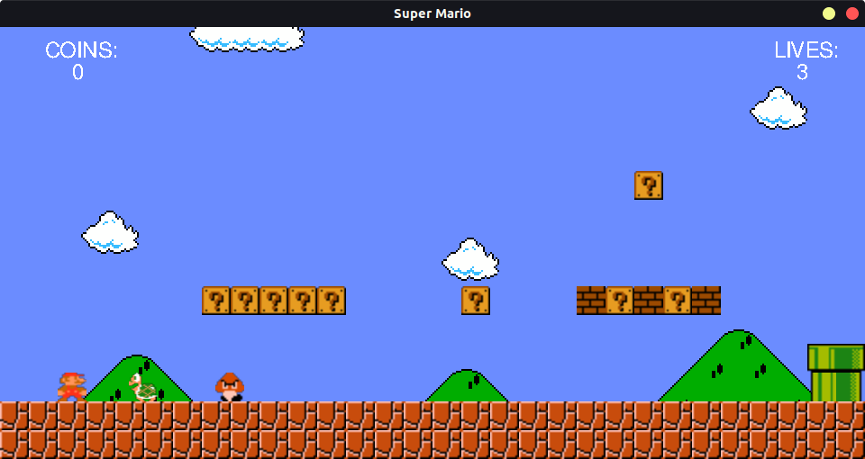

# Super Mario
<p align="center">
  
</p>
This clone of Super Mario Bros was created as an asssignment for Advanced Programming course at University of Tehran.

It is written with [RSDL](https://github.com/UTAP/RSDL) (SDL2 Wrapper). Note that using inheritance and polymorphism was forbidden for this project, which made it a bit messy.

## How to play
Compile the project using makefile. run the game with name of the level as argument.
```bash
./game.out 1.txt
```
A sample level is provided with the files (1.txt). you can also create your own levels as a text file.

## Creating your own level
Levels are just text files with special characters. See the level provided as an example. You can create your own map using this character guide:

| Char | Block |
| --- | --- |
| . | Empty Space |
| b | Brick |
| ? | Coin Block |
| m | Red Mushroom Block |
| h | Health Mushroom Block |
| @ | Normal Block |
| # | Ground Block |
| M | Mario |
| l | Little Goomba |
| k | Koopa Troopa |
| l | Pipe |
| f | Flag |


